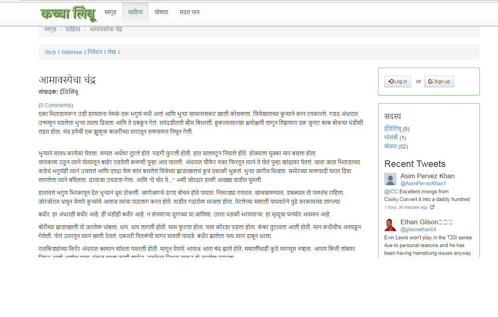
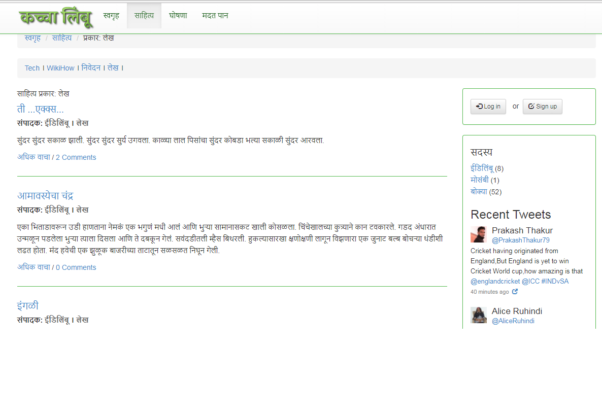
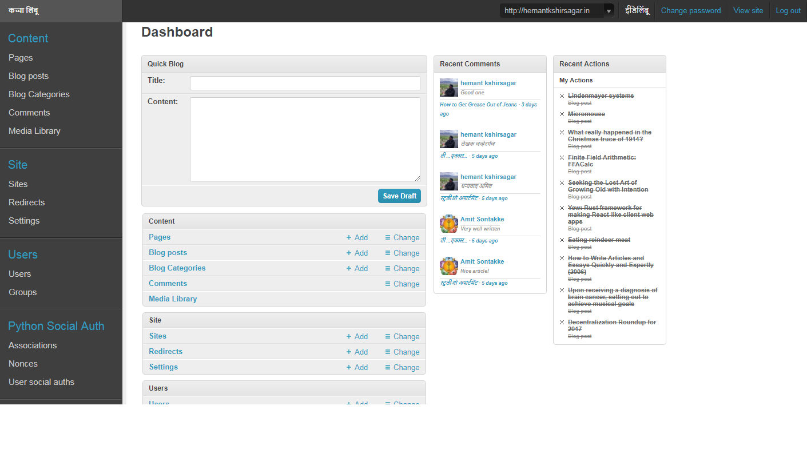
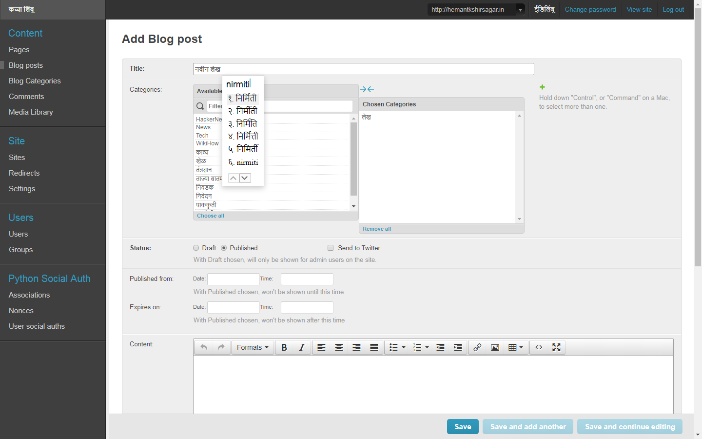
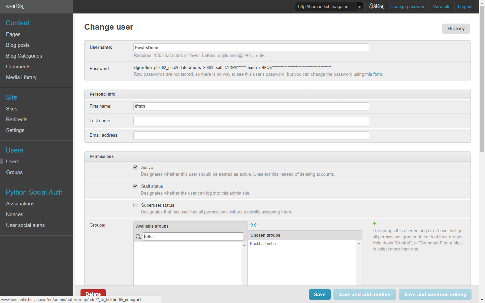

# KachhaLimbu - कच्चा लिंबू
Kachha Limbu (कच्चा लिंबू) is a Marathi blogging portal where new marathi articles can be viewed and published.
It is created using Python Django MVC framework and customising Mezzanine.
General user blog detail view:

Genaral user blog list view:

Admin Author view:

Article writting view:

User management view:

